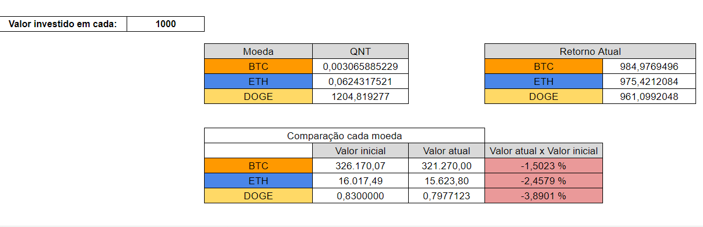

# Simulação criptomoedas
## Contextualização
### A aplicação em Python tem como objetivo buscar os valores de criptomoedas específicas de uma API em horários determinados do dia e atualizar uma planilha do Google com esses dados. O objetivo principal é analisar o comportamento individual de cada moeda, acompanhando sua valorização ou desvalorização em intervalos de tempo específicos. Além disso, a planilha oferece a capacidade de visualização de gráficos e a realização de análises gerais dos ativos.
## Api utilizada: mercadobitcoin
### Link documentação api: `https://api.mercadobitcoin.net/api/v4/docs`
## A aplicação em python está sendo executada em uma máquina virtual do google
### Link console google cloud: `https://console.cloud.google.com/`
## Imagens da aplicação integrada com o google planilhas:
   

        
      

    

        
    

      

        
    

      

        
    

